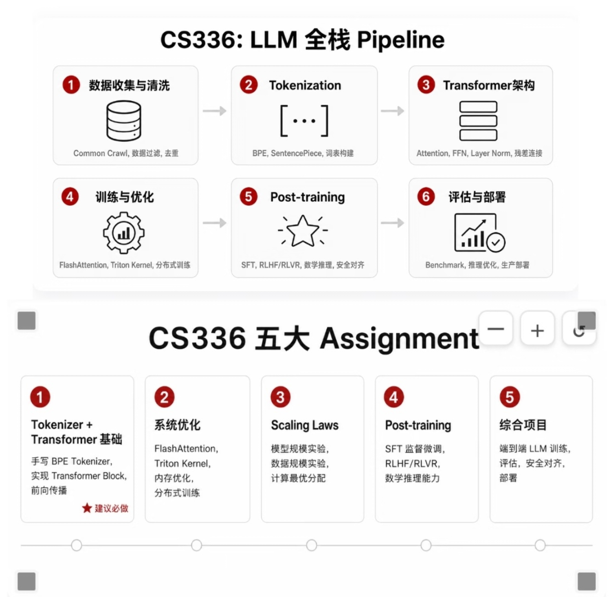

### Course

前置：
- **Python**：了解循环、类、NumPy 矩阵运算...
- **线性代数**：矩阵乘法、求导、向量空间...

学习顺序：

- **[PyTorch](https://pytorch.org/)**：CNN / RNN / Transformer ...
- **[《动手学深度学习》](https://zh.d2l.ai/)**：梯度下降、损失函数、正则化、分类与回归
- **[《深度学习入门》](https://www.ituring.com.cn/book/1921)**：`查漏补缺`，用极简公式拆解神经网络，补足数学直觉
- **[CS224N](https://web.stanford.edu/class/cs224n/)**：`前置`，词向量、注意力机制、Transformer 架构、微调基础
- **[CS336](https://cs336.stanford.edu/)**：大模型训练、并行、数据、对齐、分布式训练
- **[《深度学习》](https://www.deeplearningbook.org/)**：`工具书`，按需查阅

ps:CS336 全程基于 Transformer，CS224N 是系统讲解 NLP Transformer 的入门课

感谢Stanford，公开这么多高质量课程。

----

### Notes

-----

### Assignments

环境：之前用1*H100 完成了作业1，2，5