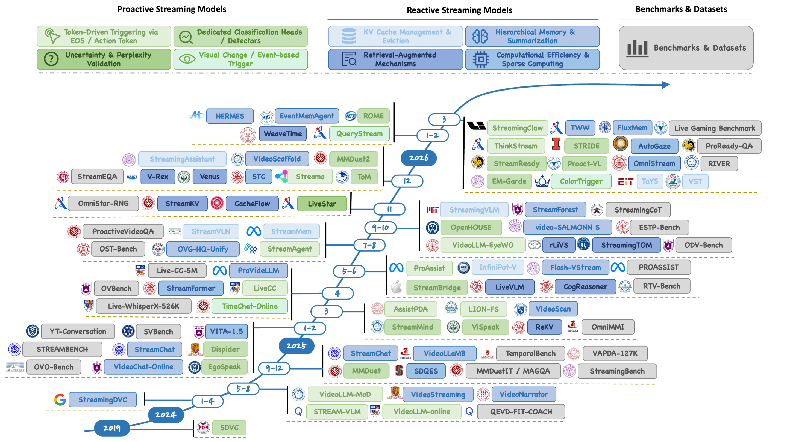

# VLM Wiki

- Vision-Language Model 资料整理与学习笔记
- **看到了什么、发生了什么、为什么发生、何时响应、如何持续低延迟运行**



参考资料见文末Resources

## 目录

- [Course](#course)
  - [计算机视觉基础](#cv-course)
  - [Transformer 与多模态基础](#multimodal-course)
- [Concept](#concept)
  - [VLM 基本架构](#vlm-architecture)
  - [视频理解与视频推理](#video-understanding)
  - [Streaming Video Understanding](#streaming-definition)
- [Paper](#paper)
  - [VLM 基座](#vlm-foundation)
  - [Video-LLM 基座](#video-llm)
  - [视频推理](#video-reasoning)
  - [主动交互：When to Speak](#proactive-interaction)
  - [长期记忆](#long-term-memory)
  - [实时推理](#realtime-inference)
  - [Streaming with Thinking](#streaming-thinking)
- [Benchmark](#benchmark)
- [Dataset](#dataset)
- [Project](#project)
- [Survey](#survey)
- [Blog](#blog)
- [Book](#book)
- [学习路线](#roadmap)
- [Resources](#resources)

---

<a id="course"></a>

## 一、Course

<a id="cv-course"></a>

### 计算机视觉基础

- [Stanford CS231n: Deep Learning for Computer Vision](https://cs231n.stanford.edu/)：CNN、视觉表征、检测与分割基础
- [Hugging Face Community Computer Vision Course](https://huggingface.co/learn/computer-vision-course/unit0/welcome/welcome)：从视觉基础到 Vision Transformer
- [UvA Deep Learning Tutorials](https://uvadlc-notebooks.readthedocs.io/en/latest/)：PyTorch、Attention、ViT 等可运行教程
- [Dive into Deep Learning：Computer Vision](https://d2l.ai/chapter_computer-vision/index.html)：卷积、检测、分割与数据增强

<a id="multimodal-course"></a>

### Transformer 与多模态基础

- [The Illustrated Transformer](https://jalammar.github.io/illustrated-transformer/)：先建立 Attention、Encoder、Decoder 的直觉
- [The Annotated Transformer](https://nlp.seas.harvard.edu/annotated-transformer/)：用 PyTorch 阅读 Transformer 实现
- [Hugging Face LLM Course](https://huggingface.co/learn/llm-course/chapter1/1)：Tokenizer、Transformer、微调与推理
- [Stanford CS336: Language Modeling from Scratch](https://stanford-cs336.github.io/spring2025/)：语言模型训练与系统基础
- [LLaVA-NeXT Documentation](https://llava-vl.github.io/)：图像、视频、多模态模型与评测生态

---

<a id="concept"></a>

## 二、Concept

<a id="vlm-architecture"></a>

### VLM 基本架构

```text
Image / Video
		↓
Vision Encoder（ViT / CLIP）
		↓
Projector / Adapter / Q-Former
		↓
Visual Tokens + Text Tokens
		↓
Large Language Model
		↓
Caption / QA / Reasoning / Action
```

建议优先掌握以下概念：

- **Vision Encoder**：把像素转换成 patch token
- **Projector / Adapter**：将视觉特征映射到 LLM 的表示空间
- **Visual Token**：LLM 能消费的视觉序列
- **Position Encoding / RoPE**：表达时间与空间位置
- **SFT**：使用图文、视频问答与 caption 数据训练模型
- **Prefill / Decode / KV Cache**：决定多模态模型的推理速度与显存

<a id="video-understanding"></a>

### 视频理解与视频推理

视频比单图多了时间轴。模型不仅要识别物体，还要处理：

- 动作、状态变化与事件边界
- 事件先后顺序、持续时间和因果关系
- 跨帧目标跟踪与空间关系
- 长视频记忆与证据检索
- 音频、字幕和画面的同步

视频推理可以按输出和思考形式分为：

1. **CoT-based Video Reasoning**：以语言 Chain-of-Thought 为主
2. **CoF-based Video Reasoning**：以帧、视频生成或视觉状态变化作为推理过程
3. **Interleaved Video Reasoning**：视频、图像与文本交替进入推理链
4. **Streaming Video Reasoning**：视频持续到来，模型只能使用过去和当前信息

<a id="streaming-definition"></a>

### Streaming Video Understanding

离线视频模型可以提前看到完整视频；Streaming 模型在时刻 $t$ 只能使用：

$$
\mathcal{I}_t = \{F_1,F_2,\ldots,F_t\}
$$

不能预览 $F_{t+1}$，也不能依赖未来证据。核心问题分为两类：

- **Proactive / When to Act**：什么时候回答、提醒、输出 caption 或保持沉默
- **Reactive / How to Sustain**：如何控制不断增长的视觉 token、记忆、KV Cache 和计算量

常见系统形态：

```text
Video Stream → Frame/Chunk Buffer → Trigger/Gate → VLM
											 ↓               ↓         ↓
								 Short-term Memory   Speak?   Response
											 ↓
								 Long-term Memory / Retrieval
```

- **Streaming input**：视频帧持续到达
- **Streaming output**：模型逐 token 输出文字
- **Dataset streaming**：训练时边下载边读取数据

---

<a id="paper"></a>

## 三、Paper

<a id="vlm-foundation"></a>

### VLM 基座

- [CLIP: Learning Transferable Visual Models From Natural Language Supervision](https://arxiv.org/abs/2103.00020)：视觉与文本对比学习基础
- [Flamingo: a Visual Language Model for Few-Shot Learning](https://arxiv.org/abs/2204.14198)：跨注意力连接视觉编码器与冻结 LLM
- [BLIP-2: Bootstrapping Language-Image Pre-training](https://arxiv.org/abs/2301.12597)：Q-Former 对齐视觉与语言
- [LLaVA: Visual Instruction Tuning](https://arxiv.org/abs/2304.08485)｜[Code](https://github.com/haotian-liu/LLaVA)：视觉指令微调经典工作
- [Qwen2-VL: Enhancing Vision-Language Model's Perception of the World at Any Resolution](https://arxiv.org/abs/2409.12191)｜[Code](https://github.com/QwenLM/Qwen2-VL)：动态分辨率与多模态 RoPE
- [Qwen2.5-VL Technical Report](https://arxiv.org/abs/2502.13923)｜[Code](https://github.com/QwenLM/Qwen2.5-VL)：长视频、定位与视觉 Agent
- [LLaVA-OneVision: Easy Visual Task Transfer](https://arxiv.org/abs/2408.03326)｜[Code](https://github.com/LLaVA-VL/LLaVA-NeXT)：统一单图、多图和视频任务
- [OneVision-Encoder: Codec-Aligned Sparsity as a Foundational Principle for Multimodal Intelligence](https://arxiv.org/abs/2602.08683)：利用运动与残差信号进行 codec-aligned 视觉编码

<a id="video-llm"></a>

### Video-LLM 基座

- [Video-LLaVA: Learning United Visual Representation by Alignment Before Projection](https://arxiv.org/abs/2311.10122)｜[Code](https://github.com/PKU-YuanGroup/Video-LLaVA)
- [VideoChat2: Advancing Spatial-Temporal Modeling and Post-Training in Video-LLMs](https://arxiv.org/abs/2311.17005)｜[Code](https://github.com/OpenGVLab/Ask-Anything)
- [LLaVA-NeXT: A Strong Zero-shot Video Understanding Model](https://llava-vl.github.io/blog/2024-04-30-llava-next-video/)｜[Code](https://github.com/LLaVA-VL/LLaVA-NeXT)
- [LongVA: Long Context Transfer from Language to Vision](https://arxiv.org/abs/2406.16852)｜[Code](https://github.com/EvolvingLMMs-Lab/LongVA)
- [LongVU: Spatiotemporal Adaptive Compression for Long Video-Language Understanding](https://arxiv.org/abs/2410.17434)｜[Code](https://github.com/Vision-CAIR/LongVU)

<a id="video-reasoning"></a>

### 视频推理

#### Language-centric / CoT

- [Video-R1: Reinforcing Video Reasoning in MLLMs](https://arxiv.org/abs/2503.21776)｜[Code](https://github.com/tulerfeng/Video-R1)
- [VideoChat-R1: Enhancing Spatio-Temporal Perception via Reinforcement Fine-Tuning](https://arxiv.org/abs/2504.06958)｜[Code](https://github.com/OpenGVLab/VideoChat-R1)
- [Thinking With Videos: Multimodal Tool-Augmented Reinforcement Learning for Long Video Reasoning](https://arxiv.org/abs/2508.04416)｜[Code](https://github.com/zhang9302002/ThinkingWithVideos)
- [Open-o3 Video: Grounded Video Reasoning with Explicit Spatio-Temporal Evidence](https://arxiv.org/abs/2510.20579)｜[Code](https://github.com/marinero4972/Open-o3-Video)
- [Video-Thinker: Sparking “Thinking with Videos” via Reinforcement Learning](https://arxiv.org/abs/2510.23473)｜[Code](https://github.com/shijian2001/Video-Thinker)

#### Vision-centric / CoF

- [Chain-of-Frames: Advancing Video Understanding via Frame-Aware Reasoning](https://arxiv.org/abs/2506.00318)｜[Code](https://github.com/SaraGhazanfari/CoF)
- [Are Video Models Ready as Zero-Shot Reasoners? MME-CoF](https://arxiv.org/abs/2510.26802)｜[Dataset](https://huggingface.co/datasets/ZiyuG/MME-CoF)
- [Thinking with Video: Video Generation as a Promising Multimodal Reasoning Paradigm](https://arxiv.org/abs/2511.04570)｜[Code](https://github.com/tongjingqi/Thinking-with-Video)

#### Interleaved Reasoning

- [Thinking With Videos](https://arxiv.org/abs/2508.04416)｜[Code](https://github.com/zhang9302002/ThinkingWithVideos)：通过工具调用在推理中主动重看视频
- [ViTCoT: Video-Text Interleaved Chain-of-Thought](https://arxiv.org/abs/2507.09876)｜[Code](https://github.com/BRZ911/ViTCoT)
- [LongVT: Thinking with Long Videos via Native Tool Calling](https://arxiv.org/abs/2511.20785)｜[Code](https://github.com/EvolvingLMMs-Lab/LongVT)

<a id="proactive-interaction"></a>

### 主动交互：When to Speak

#### 生成式 Token 触发

让模型生成 `EOS`、`<silence>`、`<response>` 或动作 token，统一学习“是否回答”和“回答内容”。

- [VideoLLM-online: Online Video Large Language Model for Streaming Video](https://arxiv.org/abs/2406.11816)｜[Code](https://github.com/showlab/VideoLLM-online)：Streaming EOS 代表保持沉默
- [What to Say and When to Say It](https://arxiv.org/abs/2407.08101)｜[Code](https://github.com/Qualcomm-AI-research/FitCoach)：`<next>` 与 `<feedback>` 动作 token
- [LiveCC: Learning Video LLM with Streaming Speech Transcription at Scale](https://arxiv.org/abs/2504.16030)｜[Code](https://github.com/showlab/livecc)：实时赛事解说与 Streaming EOS
- [ProAssist: Proactive Assistant Dialogue Generation](https://arxiv.org/abs/2506.05904)｜[Code](https://github.com/pro-assist/ProAssist)：帧级 EOS 与负样本下采样
- [Streaming Video Instruction Tuning](https://arxiv.org/abs/2512.21334)｜[Code](https://github.com/maifoundations/Streamo)：Silence、Standby、Response 三状态 token

#### 辅助 Head / Detector 触发

使用轻量分类器、路由器或 Activation Model 判断是否调用大模型。

- [MMDuet: VideoLLM Knows When to Speak](https://arxiv.org/abs/2411.17991)｜[Code](https://github.com/yellow-binary-tree/MMDuet)：Informative Head 与 Relevance Head
- [Dispider](https://arxiv.org/abs/2501.03218)｜[Code](https://github.com/Mark12Ding/Dispider)：解耦感知、决策和响应
- [StreamMind](https://arxiv.org/abs/2503.06220)｜[Code](https://github.com/xinding-sys/StreamMind)：Event-Gated Cognition，面向高帧率视频
- [ViSpeak](https://arxiv.org/abs/2503.12769)｜[Code](https://github.com/HumanMLLM/ViSpeak)：Informative Head 判断视觉反馈时机
- [StreamBridge](https://arxiv.org/abs/2505.05467)｜[Code](https://github.com/apple/ml-streambridge)：小 Activation Model 驱动离线 Video-LLM
- [Proact-VL](https://arxiv.org/abs/2603.03447)｜[Code](https://github.com/microsoft/AnthropomorphicIntelligence/tree/main/Proact-VL)：FLAG token 与 gated response head

#### Feature / Event 触发

- [TimeChat-Online: 80% Visual Tokens are Naturally Redundant](https://arxiv.org/abs/2504.17343)｜[Code](https://github.com/yaolinli/TimeChat-Online)：差分 token drop 和场景变化触发
- [LiveStar](https://arxiv.org/abs/2511.05299)｜[Code](https://github.com/sotayang/LiveStar)：通过 perplexity 验证是否需要输出
- [QueryStream](https://openreview.net/forum?id=738HjJEbml)｜[Code](https://github.com/Zhangkr2003/QueryStream)：query-aware differential pruning 与相关性触发
- [ColorTrigger](https://arxiv.org/abs/2603.22466)｜[Code](https://github.com/lvgd/ColorTrigger)：灰度常开、彩色按需激活
- [CodecSight: Leveraging Video Codec Signals for Efficient Streaming VLM Inference](https://arxiv.org/abs/2604.06036)：motion vector 引导 patch pruning，I 帧刷新 KV Cache

#### 强化学习优化响应时机

- [MMDuet2](https://arxiv.org/abs/2512.06810)｜[Code](https://github.com/yellow-binary-tree/MMDuet2)：多轮 RL 学习 Reply / No Reply
- [Thinking in Streaming Video](https://arxiv.org/abs/2603.12938)｜[Code](https://github.com/CASIA-IVA-Lab/ThinkStream)：Watch–Think–Speak 与 streaming RLVR

<a id="long-term-memory"></a>

### 长期记忆

#### 滑动窗口与淘汰

- [A Simple Baseline for Streaming Video Understanding](https://arxiv.org/abs/2604.02317)｜[Code](https://github.com/EvolvingLMMs-Lab/SimpleStream)：固定最近帧窗口，是重要 baseline
- [StreamingVLM: Real-Time Understanding for Infinite Video Streams](https://arxiv.org/abs/2510.09608)｜[Code](https://github.com/mit-han-lab/streaming-vlm)：Attention Sink、滑动窗口和连续 RoPE
- [Proact-VL](https://arxiv.org/abs/2603.03447)｜[Code](https://github.com/microsoft/AnthropomorphicIntelligence/tree/main/Proact-VL)：双 Cache 滑窗与 Reverse-RoPE eviction

#### 层次化与事件记忆

- [VideoChat-Online / OVBench](https://arxiv.org/abs/2501.00584)｜[Code](https://github.com/MCG-NJU/VideoChat-Online)：Pyramid Memory Bank
- [StreamChat](https://arxiv.org/abs/2501.13468)｜[Code](https://github.com/hmxiong/StreamChat)：短期记忆、长期记忆树与对话检索
- [StreamForest](https://arxiv.org/abs/2509.24871)｜[Code](https://github.com/MCG-NJU/StreamForest)：Persistent Event Memory Forest
- [VideoScaffold](https://arxiv.org/abs/2512.22226)｜[Code](https://github.com/zheng980629/VideoScaffold)：弹性事件切分与层次化聚合
- [EventMemAgent](https://arxiv.org/abs/2602.15329)｜[Code](https://github.com/lingcco/EventMemAgent)：事件中心双层记忆与工具调用
- [FluxMem](https://arxiv.org/abs/2603.02096)｜[Code](https://github.com/YiwengXie/FluxMem)：短、中、长期自适应层次记忆

#### Token 与 KV Cache 压缩

- [VideoScan](https://arxiv.org/abs/2503.09387)｜[Code](https://github.com/LyliAgave/VideoScan)：每帧压缩为 Semantic Carrier Token
- [InfiniPot-V](https://arxiv.org/abs/2506.15745)｜[Code](https://github.com/aiha-lab/InfiniPot-V)：时间冗余和 Value-Norm 驱动 KV 压缩
- [StreamMem](https://arxiv.org/abs/2508.15717)｜[Project](https://yangyanl.ai/streammem/)：query-agnostic KV pruning 与 merging
- [StreamingTOM](https://arxiv.org/abs/2510.18269)｜[Code](https://github.com/YIGE24/StreamingTOM)：视觉 token 压缩与 4-bit KV Memory
- [StreamKV](https://arxiv.org/abs/2511.07278)｜[Code](https://github.com/sou1p0wer/StreamKV)：分段 KV 检索与压缩
- [HERMES](https://arxiv.org/abs/2601.14724)｜[Code](https://github.com/haowei-freesky/HERMES)：将 KV Cache 组织成感觉、工作与长期记忆

#### 检索增强记忆

- [ReKV](https://arxiv.org/abs/2503.00540)｜[Code](https://github.com/Becomebright/ReKV)：KV Cache 下放 CPU/磁盘并按问题检索
- [Flash-VStream](https://arxiv.org/abs/2506.23825)｜[Code](https://github.com/IVGSZ/Flash-VStream)：摘要记忆与细节增强记忆
- [CogStream](https://arxiv.org/abs/2506.10516)｜[Code](https://github.com/LiamZhao326/CogStream)：事件压缩与历史对话检索
- [WeaveTime](https://arxiv.org/abs/2602.22142)｜[Code](https://github.com/zhangyl4/weavetime)：不确定性触发的粗到细历史检索

<a id="realtime-inference"></a>

### 实时推理

#### 编码—解码并行

- [Speak While Watching](https://arxiv.org/abs/2601.06843)｜[Code](https://github.com/EIT-NLP/Speak-While-Watching)：并行感知与生成
- [Think-as-You-See](https://arxiv.org/abs/2603.02872)｜[Code](https://github.com/EIT-NLP/StreamingLLM/tree/main/TaYS)：Parallel Dual KV Cache
- [Think While Watching](https://arxiv.org/abs/2603.11896)｜[Code](https://github.com/wl666hhh/Think_While_Watching)：异步 Watch–Think Pipeline

#### 稀疏调用与视觉计算

- [VideoLLM-MoD](https://arxiv.org/abs/2408.16730)：Mixture-of-Depths 跳过冗余视觉层计算
- [LION-FS](https://arxiv.org/abs/2503.03663)｜[Code](https://github.com/JiuTian-VL/LION-FS)：Fast Path 判断时机，Slow Path 生成回答
- [StreamMind](https://arxiv.org/abs/2503.06220)｜[Code](https://github.com/xinding-sys/StreamMind)：轻量 Gate 持续运行，重模型按事件调用
- [STC: Hierarchical Token Compression](https://arxiv.org/abs/2512.00891)｜[Code](https://github.com/lern-to-write/STC)：ViT 特征复用与 LLM 前 token pruning
- [AutoGaze](https://arxiv.org/abs/2603.12254)｜[Code](https://github.com/NVlabs/AutoGaze)：在 ViT 前自回归选择少量多尺度 patch

#### 推理系统关键指标

- **TTFT**：Time to First Token
- **TPOT**：Time per Output Token
- **RTF**：推理耗时 / 视频时长，实时系统通常要求 $RTF < 1$
- **P50 / P95 latency**：平均体验与尾延迟
- **Model call ratio**：真正调用重模型的帧或 chunk 比例
- **Visual tokens/s**：视觉侧处理吞吐
- **Peak GPU memory**：峰值显存

<a id="streaming-thinking"></a>

### Streaming with Thinking

- [StreamingCoT](https://arxiv.org/abs/2510.25332)｜[Code](https://github.com/Fleeting-hyh/StreamingCoT)：Streaming VideoQA 与多模态 CoT 数据
- [Video Streaming Thinking](https://arxiv.org/abs/2603.12262)｜[Code](https://github.com/1ranGuan/VST)：边看边思考，VST-SFT + VST-RL
- [Think While Watching](https://arxiv.org/abs/2603.11896)｜[Code](https://github.com/wl666hhh/Think_While_Watching)：持续 segment memory 与并行推理
- [Thinking in Streaming Video](https://arxiv.org/abs/2603.12938)｜[Code](https://github.com/CASIA-IVA-Lab/ThinkStream)：Watch–Think–Speak 与 reasoning-compressed memory
- [Think-as-You-See](https://arxiv.org/abs/2603.02872)｜[Code](https://github.com/EIT-NLP/StreamingLLM/tree/main/TaYS)：因果 streaming attention 与双 KV Cache

---

<a id="benchmark"></a>

## 四、Benchmark

### Streaming QA、记忆与推理

- [StreamingBench](https://arxiv.org/abs/2411.03628)｜[Code & Data](https://github.com/THUNLP-MT/StreamingBench)：实时、全局与上下文理解
- [OVBench](https://arxiv.org/abs/2501.00584)｜[Code & Data](https://github.com/MCG-NJU/VideoChat-Online)：过去记忆、当前感知与未来预测
- [OVO-Bench](https://arxiv.org/abs/2501.05510)｜[Code & Data](https://github.com/JoeLeelyf/OVO-Bench)：Backward Tracing、实时感知和主动响应
- [StreamBench](https://arxiv.org/abs/2501.13468)｜[Code](https://github.com/hmxiong/StreamChat)：长短期记忆与多轮交互
- [SVBench](https://arxiv.org/abs/2502.10810)｜[Code](https://github.com/sotayang/SVBench)：时序多轮视频对话
- [RTV-Bench](https://arxiv.org/abs/2505.02064)｜[Code](https://github.com/LJungang/RTV-Bench)：持续感知、理解和推理
- [OST-Bench](https://arxiv.org/abs/2507.07984)｜[Code](https://github.com/InternRobotics/OST-Bench)：在线时空场景理解
- [ODV-Bench](https://arxiv.org/abs/2509.24871)｜[Dataset](https://huggingface.co/datasets/MCG-NJU/ODV-Bench)：自动驾驶在线理解
- [RIVER](https://arxiv.org/abs/2603.03985)｜[Code](https://github.com/OpenGVLab/RIVER)：实时交互、记忆、感知与预判

### 主动响应与响应时机

- [OmniMMI](https://arxiv.org/abs/2503.22952)｜[Code & Data](https://github.com/OmniMMI/OmniMMI)：流式理解、告警、轮次切换与动作规划
- [ViSpeak](https://arxiv.org/abs/2503.12769)｜[Code & Data](https://github.com/HumanMLLM/ViSpeak)：视觉唤醒、打断与反馈
- [PROASSIST](https://arxiv.org/abs/2506.05904)｜[Code & Data](https://github.com/pro-assist/ProAssist)：第一视角任务指导与响应时机
- [ProactiveVideoQA](https://arxiv.org/abs/2507.09313)｜[Code & Data](https://github.com/yellow-binary-tree/ProactiveVideoQA)：Web、Ego、剧集与异常场景
- [ESTP-Bench / Eyes Wide Open](https://arxiv.org/abs/2510.14560)｜[Code](https://github.com/zhangyl4/EyeWO)：Just-in-Time 响应与主动请求高清帧
- [Proact-VL Live Gaming Benchmark](https://proact-vl.github.io/)：实时游戏解说、协同解说和用户指导

### 视频推理综合评测

- [Video-MME](https://arxiv.org/abs/2405.21075)｜[Code](https://github.com/BradyFU/Video-MME)：短、中、长视频综合理解
- [MVBench](https://arxiv.org/abs/2311.17005)｜[Code](https://github.com/OpenGVLab/Ask-Anything/tree/main/video_chat2)：多任务时空理解
- [VideoVista](https://arxiv.org/abs/2406.11303)｜[Code](https://github.com/HITsz-TMG/Uni-MoE/tree/master/VideoVista)：视频理解与推理
- [VideoReasonBench](https://arxiv.org/abs/2505.23359)｜[Code](https://github.com/llyx97/video_reason_bench)：视觉中心复杂推理
- [Video-Holmes](https://arxiv.org/abs/2505.21374)｜[Code](https://github.com/TencentARC/Video-Holmes)：复杂长视频推理
- [VCRBench](https://arxiv.org/abs/2505.08455)｜[Code](https://github.com/pritamqu/VCRBench)：长视频因果推理

---

<a id="dataset"></a>

## 五、Dataset

### Streaming Caption 与 Narration

- [Live-CC-5M](https://huggingface.co/datasets/chenjoya/Live-CC-5M)：大规模流式 ASR 视频预训练数据
- [Live-WhisperX-526K](https://huggingface.co/datasets/chenjoya/Live-WhisperX-526K)：密集实时解说与指令微调
- [OmniStar-RNG](https://huggingface.co/datasets/yzy666/OmniStar-RNG)：实时 narration、dense caption 和视频文本对齐
- [MMDuetIT](https://huggingface.co/datasets/wangyueqian/MMDuetIT)：多答案 grounded QA、主动响应与时间定位

### Streaming QA 与交互

- [OVBench](https://huggingface.co/datasets/MCG-NJU/OVBench)
- [OVO-Bench](https://huggingface.co/datasets/JoeLeelyf/OVO-Bench)
- [SVBench](https://github.com/sotayang/SVBench)
- [StreamBench](https://huggingface.co/datasets/Barry-12138/StreamBench_v0.3)
- [ODV-Bench](https://huggingface.co/datasets/MCG-NJU/ODV-Bench)
- [TemporalBench](https://huggingface.co/datasets/microsoft/TemporalBench)

数据设计时需要显式保存：`video/chunk`、时间戳、历史对话、事件区间、响应内容以及 `silence/respond` 标签，避免训练阶段意外读取未来信息。

---

<a id="project"></a>

## 六、Project

- [NVIDIA Live VLM WebUI](https://github.com/NVIDIA-AI-IOT/live-vlm-webui)｜[Docs](https://build.nvidia.com/spark/live-vlm-webui/overview)：摄像头实时 VLM WebUI
- [VideoLLM-online](https://github.com/showlab/VideoLLM-online)：Streaming EOS 基础实现
- [LiveCC](https://github.com/showlab/livecc)：实时视频 commentary
- [StreamBridge](https://github.com/apple/ml-streambridge)：将离线 Video-LLM 改造成主动 Streaming Assistant
- [StreamingVLM](https://github.com/mit-han-lab/streaming-vlm)：无限流、固定显存与 KV Cache 管理
- [SimpleStream](https://github.com/EvolvingLMMs-Lab/SimpleStream)：固定滑动窗口 baseline，适合首先复现
- [StreamMind](https://github.com/xinding-sys/StreamMind)：高帧率事件门控方案
- [Proact-VL](https://github.com/microsoft/AnthropomorphicIntelligence/tree/main/Proact-VL)：实时 AI companion 与游戏场景
- [OneVision-Encoder Models](https://huggingface.co/collections/lmms-lab-encoder/onevision-encoder-6978aeb2bbe1aa13fad12d4c)：Codec-aligned Vision Encoder

---

<a id="survey"></a>

## 七、Survey

- [Towards Online Interactors: A Comprehensive Survey on Streaming Video Understanding](https://sotayang.github.io/Streaming_Video_Understanding_Survey.pdf)：围绕主动触发、长期记忆、稀疏计算和评测整理 Streaming Video Understanding
- [A Survey on Generative AI and LLM for Video Generation, Understanding, and Streaming](https://arxiv.org/abs/2404.16038)：视频生成、理解与流式处理综述
- [The Landscape of Video Reasoning: Tasks, Paradigms and Benchmarks](https://github.com/LJungang/Awesome-Video-Reasoning-Landscape)：CoT、CoF、Interleaved 与 Streaming Video Reasoning

---

<a id="blog"></a>

## 八、Blog

### Vision Transformer

- [The Illustrated Vision Transformer](https://jalammar.github.io/illustrated-transformer/)
- [An Image is Worth 16x16 Words](https://arxiv.org/abs/2010.11929)
- [Hugging Face Vision Transformer Explained](https://huggingface.co/blog/vit)

### Video 与 Codec

- [FFmpeg Documentation](https://ffmpeg.org/documentation.html)
- [A Beginner's Guide for FFMPEG](https://img.ly/blog/ultimate-guide-to-ffmpeg/)
- [Video Coding Concepts](https://developer.mozilla.org/en-US/docs/Web/Media/Guides/Formats/Video_concepts)：帧率、I/P/B 帧、压缩与码率

### 推理与 KV Cache

- [vLLM: Easy, Fast, and Cheap LLM Serving](https://vllm.ai/)
- [PagedAttention Paper](https://arxiv.org/abs/2309.06180)
- [Hugging Face KV Cache Strategies](https://huggingface.co/docs/transformers/kv_cache)
- [FlashAttention: Fast and Memory-Efficient Exact Attention](https://arxiv.org/abs/2205.14135)

---

<a id="book"></a>

## 九、Book

- [Dive into Deep Learning](https://d2l.ai/)：深度学习、Transformer 与计算机视觉入门
- [Deep Learning for Vision Systems](https://www.manning.com/books/deep-learning-for-vision-systems)：视觉任务工程实践
- [Computer Vision: Algorithms and Applications](https://szeliski.org/Book/)：经典计算机视觉理论
- [Natural Language Processing with Transformers](https://www.oreilly.com/library/view/natural-language-processing/9781098136789/)：Transformers 与 Hugging Face 实践
- [Designing Machine Learning Systems](https://www.oreilly.com/library/view/designing-machine-learning/9781098107956/)：数据、训练、部署和监控

---

<a id="roadmap"></a>

## 十、路线

### Stage 1：VLM 基础

1. 学习 PyTorch Tensor、Module、Dataset 和 GPU 推理
2. 理解 ViT、Patch Embedding、Attention 和 RoPE
3. 阅读 CLIP、BLIP-2、LLaVA、Qwen2-VL
4. 跑通单图 caption 与 VQA

### Stage 2：Video-LLM

1. 使用 FFmpeg / Decord 解码视频并均匀抽帧
2. 理解 `[T,C,H,W] → visual tokens → LLM` 数据流
3. 跑通 Video-MME 或 MVBench 的小规模评测
4. 比较帧数、分辨率、视觉 token 数与显存、延迟的关系

### Stage 3：Streaming Baseline

1. 将视频切成严格因果的 chunk，禁止使用未来帧
2. 实现固定长度滑动窗口
3. 在每个 chunk 输出 caption、answer 或 silence
4. 记录 TTFT、P95、RTF、显存和 model call ratio

### Stage 4：主动触发与长期记忆

1. 对比固定周期、帧差、codec residual 和轻量分类 Head
2. 加入 `<silence>/<response>` 或独立 response head
3. 实现短期滑窗 + 长期文本/事件/KV 记忆
4. 在 OVO-Bench、SVBench、RTV-Bench 上做消融

### Stage 5：高帧率与 VLA

1. 使用 lightweight gate 持续感知，重模型按事件调用
2. 将输出从 caption 扩展为离散 action token
3. 测量 action latency、decision FPS、return 和 model call ratio
4. 研究 codec motion vector / residual 引导的区域级 patch selection

```text
SimpleStream（baseline）
	→ VideoLLM-online（EOS / silence）
	→ StreamBridge（独立触发器）
	→ StreamMind（高帧率稀疏调用）
	→ StreamingVLM / HERMES（KV Cache 与长期记忆）
	→ CodecSight / OneVision-Encoder（Codec-aware 推理）
```

---

<a id="resources"></a>

Resources

- [sotayang/Awesome-Streaming-Video-Understanding](https://github.com/sotayang/Awesome-Streaming-Video-Understanding)
- [ydyhello/Awesome-VLM-Streaming-Video](https://github.com/ydyhello/Awesome-VLM-Streaming-Video)
- [LJungang/Awesome-Video-Reasoning-Landscape](https://github.com/LJungang/Awesome-Video-Reasoning-Landscape)
- [Video-Reason/Awesome-Video-Reasoning](https://github.com/Video-Reason/Awesome-Video-Reasoning)
- [yunlong10/Awesome-LLMs-for-Video-Understanding](https://github.com/yunlong10/Awesome-LLMs-for-Video-Understanding)
- [yunlong10/Awesome-Video-LMM-Post-Training](https://github.com/yunlong10/Awesome-Video-LMM-Post-Training)
- [zhengxuJosh/Awesome-Multimodal-Spatial-Reasoning](https://github.com/zhengxuJosh/Awesome-Multimodal-Spatial-Reasoning)

> 资料更新较快，论文发表状态、代码和模型权重以原项目页面为准。欢迎提交 PR 补充课程、论文复现、实验记录和中文笔记。
